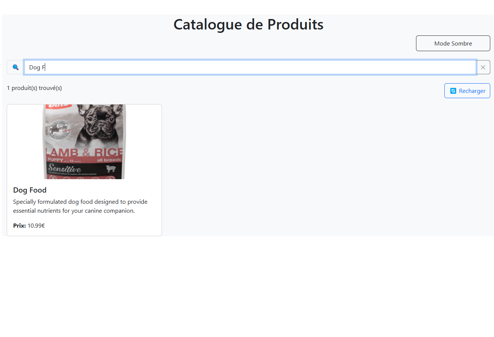
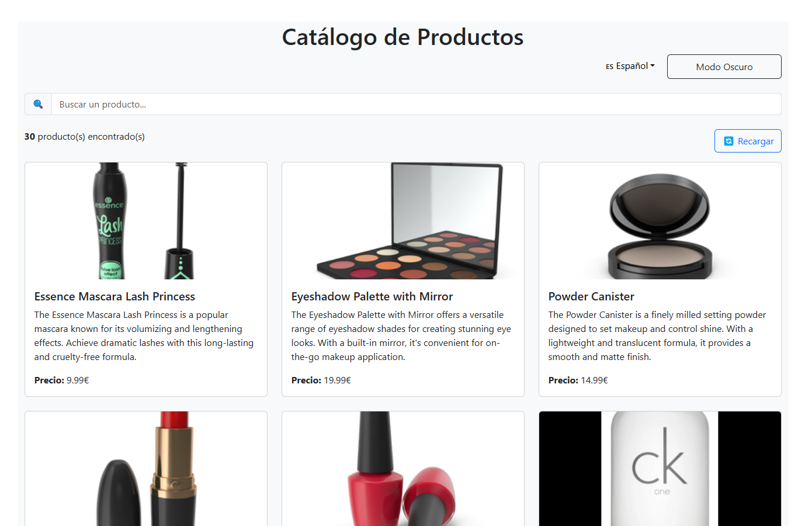
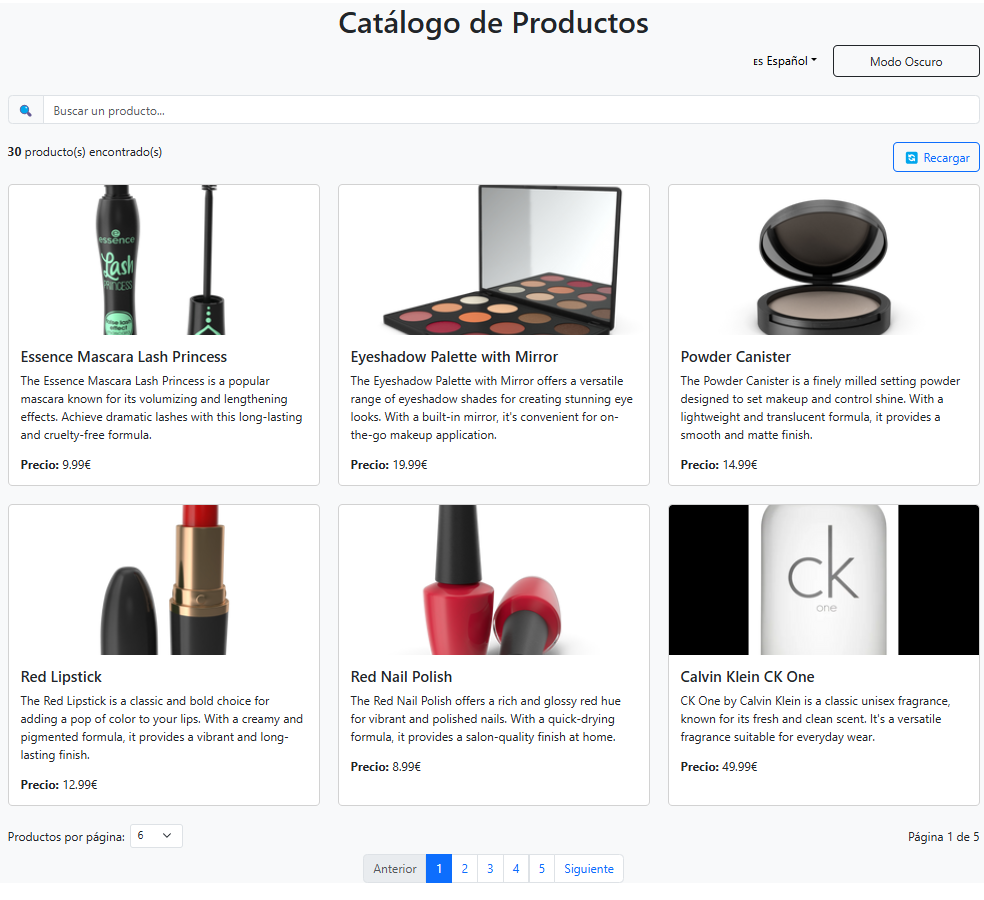
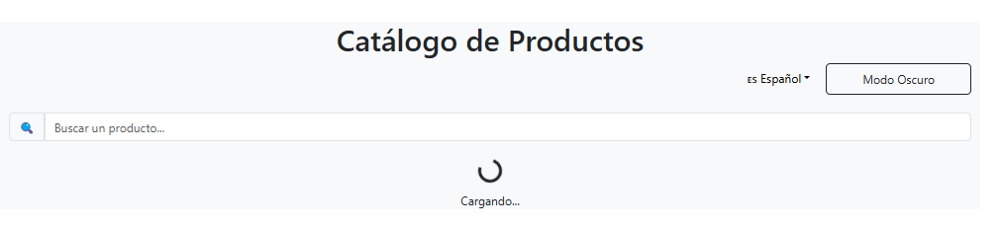

# TP React Hooks - Application de Gestion de Produits

Ce TP a pour objectif de mettre en pratique l'utilisation des Hooks React (useState, useEffect, useContext) ainsi que la création de Hooks personnalisés.

## Installation et configuration initiale

1. Cloner le dépôt :
```bash
git clone https://github.com/pr-daaif/tp-react-hooks.git
cd tp-react-hooks
```

2. Créer votre propre dépôt sur Github et changer le remote :
```bash
# Supprimer le remote origine
git remote remove origin

# Ajouter votre nouveau remote
git remote add origin https://github.com/[votre-username]/tp-react-hooks.git

# Premier push
git push -u origin main
```

3. Installer les dépendances :
```bash
npm install
```

4. Lancer l'application :
```bash
npm start
```

## Instructions pour le TP

Pour chaque exercice :
1. Lisez attentivement l'énoncé
2. Implémentez la solution
3. Testez votre implémentation (pensez à faire des copies d'écran)
4. Mettez à jour la section correspondante dans ce README avec :
   - Une brève explication de votre solution
   - Des captures d'écran montrant le fonctionnement
   - Les difficultés rencontrées et comment vous les avez résolues
5. Commitez vos changements avec un message descriptif

### Exercice 1 : État et Effets 
#### Objectif : Implémenter une recherche en temps réel

- [ ] 1.1 Modifier le composant ProductSearch pour utiliser la recherche
- [ ] 1.2 Implémenter le debounce sur la recherche
- [ ] 1.3 Documenter votre solution ici

_Votre réponse pour l'exercice 1 :_
```
J'ai implémenté une recherche en temps réel avec debounce en créant plusieurs composants et hooks :

Hook useDebounce : Un hook personnalisé qui retarde la mise à jour d'une valeur pour éviter des appels trop fréquents pendant la saisie.
Modification du hook useProductSearch :

Ajout de la gestion du terme de recherche
Implémentation du filtrage des produits en fonction du terme recherché
Utilisation du hook useDebounce pour éviter trop de rendus lors de la saisie


Contexte de recherche :

Création d'un contexte ProductSearchContext pour partager le terme de recherche entre les composants


Modification du composant ProductSearch :

Ajout d'une interface utilisateur améliorée avec icône de recherche
Bouton pour effacer la recherche
Connexion au contexte de recherche


Mise à jour du composant ProductList :

Affichage du nombre de résultats
Gestion du cas où aucun produit ne correspond à la recherche
Utilisation du terme de recherche pour filtrer les produits
```


### Exercice 2 : Context et Internationalisation
#### Objectif : Gérer les préférences de langue

- [ ] 2.1 Créer le LanguageContext
- [ ] 2.2 Ajouter le sélecteur de langue
- [ ] 2.3 Documenter votre solution ici

_Votre réponse pour l'exercice 2 :_
```
J'ai implémenté une solution robuste d'internationalisation pour l'application en suivant les meilleures pratiques :

Architecture i18n professionnelle :

Séparation claire des traductions dans un fichier dédié
Utilisation de hooks personnalisés pour une meilleure réutilisabilité
Support complet pour le français, l'anglais et l'espagnol


Hooks et contextes améliorés :

Hook useLanguage pour accéder facilement aux fonctions de traduction
Hook useLocalStorage pour la persistance des préférences de langue
Architecture de contexte optimisée avec gestion d'erreurs


Sélecteur de langue intuitif :

Interface utilisateur avec drapeaux et noms de langues
Gestion manuelle du dropdown pour éviter les dépendances externes
Indicateur visuel de la langue actuellement sélectionnée


Traduction complète de l'interface :

Tous les textes statiques de l'application sont internationalisés
Messages d'erreur, titres, boutons et libellés traduits
Interface utilisateur adaptée aux différentes langues


Amélioration de l'architecture des composants :

Séparation des préoccupations avec un composant AppContent
Simplification de l'arbre de composants pour une meilleure performance
Organisation claire des responsabilités
```


### Exercice 3 : Hooks Personnalisés
#### Objectif : Créer des hooks réutilisables

- [ ] 3.1 Créer le hook useDebounce
- [ ] 3.2 Créer le hook useLocalStorage
- [ ] 3.3 Documenter votre solution ici

_Votre réponse pour l'exercice 3 :_
```
Le hook useDebounce est un hook personnalisé qui permet de retarder la mise à jour d'une valeur. C'est particulièrement utile pour les opérations coûteuses comme les recherches en temps réel, où vous ne voulez pas lancer une recherche à chaque frappe de clavier.
javascriptCopyimport { useState, useEffect } from 'react';

const useDebounce = (value, delay = 500) => {
  const [debouncedValue, setDebouncedValue] = useState(value);

  useEffect(() => {
    // Créer un timer qui mettra à jour la valeur après le délai spécifié
    const timer = setTimeout(() => {
      setDebouncedValue(value);
    }, delay);

    // Nettoyer le timer si value change avant la fin du délai
    return () => {
      clearTimeout(timer);
    };
  }, [value, delay]);

  return debouncedValue;
};

export default useDebounce;
Fonctionnement :

Quand value change, un timer est lancé
Si value change à nouveau avant la fin du timer, le timer précédent est annulé et un nouveau est créé
Une fois le délai écoulé sans changement, debouncedValue est mise à jour

Le hook useLocalStorage est un hook personnalisé qui étend la fonctionnalité de useState pour persister automatiquement les données dans le localStorage du navigateur.
javascriptCopyimport { useState, useEffect } from 'react';

const useLocalStorage = (key, initialValue) => {
  // Fonction pour récupérer la valeur initiale
  const getStoredValue = () => {
    try {
      const item = window.localStorage.getItem(key);
      return item ? JSON.parse(item) : initialValue;
    } catch (error) {
      console.error(`Error reading localStorage key "${key}":`, error);
      return initialValue;
    }
  };

  // État basé sur la valeur dans localStorage
  const [storedValue, setStoredValue] = useState(getStoredValue);

  // Fonction pour mettre à jour la valeur
  const setValue = (value) => {
    try {
      // Permettre la valeur d'être une fonction (comme dans useState)
      const valueToStore = value instanceof Function ? value(storedValue) : value;
      
      // Sauvegarder dans l'état
      setStoredValue(valueToStore);
      
      // Sauvegarder dans localStorage
      window.localStorage.setItem(key, JSON.stringify(valueToStore));
    } catch (error) {
      console.error(`Error setting localStorage key "${key}":`, error);
    }
  };

  // Mettre à jour localStorage si la clé change
  useEffect(() => {
    const storedValue = getStoredValue();
    setStoredValue(storedValue);
  }, [key]);

  return [storedValue, setValue];
};

export default useLocalStorage;
Fonctionnement :

À l'initialisation, le hook vérifie si une valeur existe déjà dans localStorage
La fonction setValue met à jour à la fois l'état React et le localStorage
Les erreurs sont gérées proprement pour éviter les plantages de l'application
Le hook réagit aux changements de la clé pour mettre à jour l'état
```

### Exercice 4 : Gestion Asynchrone et Pagination
#### Objectif : Gérer le chargement et la pagination

- [ ] 4.1 Ajouter le bouton de rechargement
- [ ] 4.2 Implémenter la pagination
- [ ] 4.3 Documenter votre solution ici

_Votre réponse pour l'exercice 4 :_
```
Exercice 4 : Gestion Asynchrone et Pagination
Solution implémentée
Pour cet exercice, j'ai développé une solution complète de gestion asynchrone des données et de pagination pour l'application de catalogue de produits.
Gestion asynchrone avec le bouton de rechargement
J'ai implémenté un bouton de rechargement qui permet aux utilisateurs de rafraîchir les données depuis l'API sans recharger la page entière. Cette fonctionnalité est particulièrement utile pour les applications qui affichent des données en temps réel ou qui doivent être régulièrement mises à jour.
Dans le hook useProductSearch, j'ai ajouté une fonction reloadProducts qui :

Réinitialise l'état de chargement
Exécute un nouvel appel à l'API
Gère les erreurs potentielles
Réinitialise la pagination à la première page

L'utilisateur bénéficie d'un retour visuel clair pendant le rechargement grâce à un indicateur de chargement (spinner).
Système de pagination avancé
La pagination mise en place offre une navigation intuitive à travers les produits avec :

Une division dynamique des produits en pages selon la préférence de l'utilisateur
Des contrôles de navigation complets (boutons Précédent/Suivant et numéros de page)
Un sélecteur permettant de choisir le nombre de produits par page (3, 6, 9 ou 12)
Un indicateur montrant la position actuelle (Page X sur Y)
Une mise en évidence visuelle de la page active

Le système de pagination réagit intelligemment aux actions de l'utilisateur :

Retour automatique à la première page après une recherche
Désactivation des boutons de navigation lorsqu'ils atteignent leurs limites
Adaptation du nombre total de pages lors de la modification du nombre d'éléments par page
```


## Rendu

- Ajoutez l'URL de votre dépôt Github dans  **Classroom** et envoyer la réponse dès le démarage de votre projet.
- Les push doivent se faire au fûr et à mesure que vous avancez dans votre projet.
- Le README.md doit être à jour avec vos réponses et captures d'écran. 
- Chaques exercice doit faire l'objet d'au moins un commit avec un message mentionnant le numéro de l'exercice.